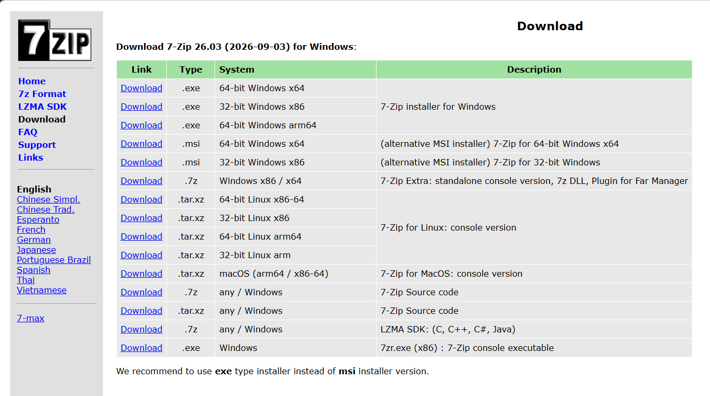

:safety_pin:   **Cybersecurity Lab Environment Setup**


## **Building an isolated virtual lab for penetration testing and ethical hacking practice**


---

## 📌 Project Overview

This project focuses on setting-up a controlled and isolated environment using VirtualBox and Kali Linux for hands-on practice in VAPT, scanning, cybersecurity tools, and other security testing activities. The lab is completely isolated from production networks to ensure safe experimentation and learning without risking real systems.

---

## 🎯 Objectives

The main objectives of this project are to:

- Install and configure VirtualBox
- Import Kali Linux as a virtual machine (VM)
- Create a private NAT Network for the cybersecurity lab
- Configure network connectivity for Kali Linux
- Assign a consistent IP address to the Kali VM
- Verify network connectivity and DNS resolution
- Take a clean VM snapshot for recovery
- Document the complete setup process
- Prepare the environment for future cybersecurity projects

---

## 🛡️ Purpose of the Lab

The lab aims to provide an isolated environment for cybersecurity practices and learning. This lab does not compromise systems in any unethical way.

It can be used for activities such as:
- Network reconnaissance
- Port scanning
- Vulnerability assessment
- Packet analysis
- Web security testing
- Exploitation practice
- Security tool experimentation

⚠️ **Important:** This laboratory must only be conducted on systems that are personally owned or for which explicit permission has been granted by the authorized owner to test.

---

## 🏗️ Lab Architecture

```
       HOST COMPUTER
          ⬇️
       VirtualBox
          ⬇️
       NAT Network
          ⬇️
      10.0.0.0/24
          ⬇️
      Kali Linux
          ⬇️
      10.0.0.2
```

Additional target machines can be added to the same virtual network in future projects.

---

## ⚙️ Lab Configuration

| 🧩 Component | ⚙️ Configuration |
| :--- | :--- |
| 🖥️ Host OS | Windows 11 |
| 🧠 Host RAM | 8 GB |
| ⚡ Processor | Intel Celeron |
| 🧰 Hypervisor | VirtualBox 7.2 |
| 🐉 Security OS | Kali Linux 2026.2 |
| 🧠 Kali RAM | 2048 MB (2GB) |
| 🌐 Virtual Network | NAT Network |
| 📡 Network Address | 10.0.0.0/24 |
| 🐧 Kali IP Address | 10.0.0.2/24 |
| 🚪 Default Gateway | 10.0.0.1 |
| 🌍 DNS Server | 8.8.8.8 or 10.0.0.1 |
| 🔮 Future VM Range | 10.0.0.3–10.0.0.99 |

---

## 🪜 Lab Setup Procedure

### Step 1: Install 7-zip



**Purpose:** 7-zip is a free and open-source file archiver used for compressing and extracting files. It supports multiple compression formats and provides excellent compression ratios.

**Tool:** 7-zip

---

### Step 2: Install VirtualBox

Oracle VirtualBox 7.2 was downloaded and installed as the hypervisor for creating and managing the virtual cybersecurity laboratory. VirtualBox provides the virtualization environment required to run multiple virtual machines simultaneously on a single host system. The extension pack was also installed to enable USB 2.0/3.0 support and other advanced features.

---

### Step 3: Create the NAT Network

A standalone NAT Network was configured inside Oracle VirtualBox.

**Configuration:**
- **Network Name:** NatNetwork
- **IPv4 Prefix:** 10.0.0.0/24
- **DHCP:** Enabled
- **IPv6:** Disabled


A *NAT Network* was selected because multiple virtual machines connected to the same NAT Network can communicate with each other while also having external network connectivity. This will allow future lab exercises to include multiple VMs that can interact with each other while maintaining isolation from the production network.

---

### Step 4: Import Kali Linux

Kali Linux was imported from the official Kali organization website. Kali Linux acts as the attacking machine. It is best to download the latest version compatible with the VirtualBox hypervisor.


**VM Adapter Network Configuration:**

| Configuration Item | Value |
| :--- | :--- |
| **Adapter** | Adapter 1 |
| **Attached to** | NAT Network |
| **Network** | NatNetwork |
| **Adapter Type** | Intel PRO/1000 MT Desktop |
| **RAM** | 2048 MB (2GB) |

---

### Step 5: Configure the Network

Network configuration is performed through the Wired Connection settings in Kali Linux.

The Kali Linux network was configured with a consistent IPv4 address:
- **IP Address:** 10.0.0.2
- **Subnet Mask:** 255.255.255.0
- **Gateway:** 10.0.0.1
- **DNS:** 8.8.8.8


---

### Step 6: Take VM Snapshot

After completing the initial configuration, a VirtualBox snapshot was created to serve as a clean baseline of the laboratory. The snapshot represents the initial state before any testing begins.

**Example Snapshot Name:** "Kali-Lab-Clean-Setup"

If a future exercise changes or damages the VM configuration, the machine can be restored to this baseline snapshot for recovery.


---

## 🐛 Problems Encountered and Solutions

**Problem 1:** Confusion during VirtualBox setup regarding which host version to download and difficulty locating the network manager in the newer version.

**Solution:** Reviewed official VirtualBox documentation and identified the correct host version for Windows 11. Located network settings in the new interface layout.

---

**Problem 2:** Difficulty distinguishing between Kali Linux zip format and 7z format during extraction. Storage space was insufficient initially.

**Solution:** Used 7-zip utility to extract files and freed up storage space by uninstalling unnecessary applications.

---

## 💡 What I Learned

- Understood the difference between VirtualBox and the hypervisor's extension packages
- Differentiated between NAT and NAT Network configurations
- Learned proper storage management techniques
- Gained familiarity with processor specifications and RAM allocation
- Realized the importance of creating clean snapshots before performing risky or experimental activities to provide a recovery point
- Understood how vital documentation is for cybersecurity professionals - recording problems, solutions, configurations, and step-by-step procedures

---

## 🔐 Security and Ethical Use

This laboratory is strictly used for educational purposes only. All activities conducted within this lab must comply with applicable laws and regulations. Unauthorized access to computer systems is illegal and unethical. All penetration testing and security assessments must be conducted only on systems for which explicit written permission has been obtained from the authorized owner.

---

## 🔗 Tools & Resources

- **7-Zip:** https://7-zip.org/download.html
- **VirtualBox:** https://virtualbox.org/wiki/Downloads
- **Kali Linux:** https://kali.org/get-kali

---

## 👤 Author

**Anju**  
Cybersecurity Intern BO83

**LinkedIn:** www.linkedin.com/in/anju-84b8ba394
